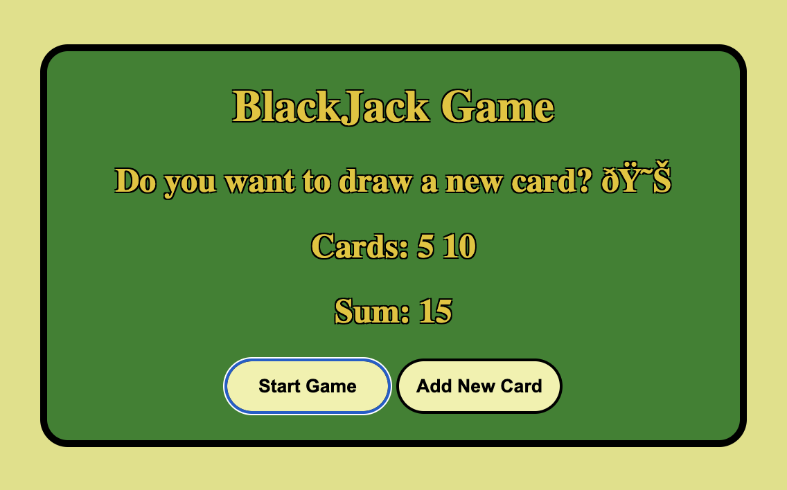
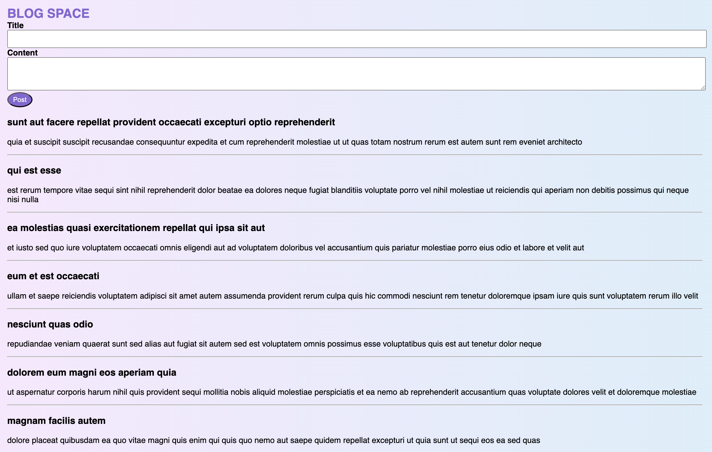
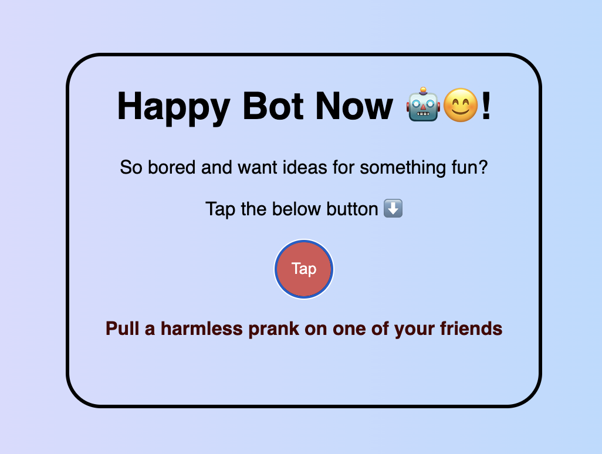
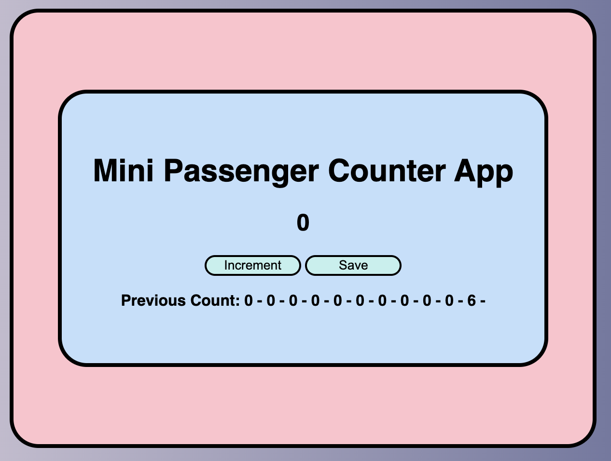
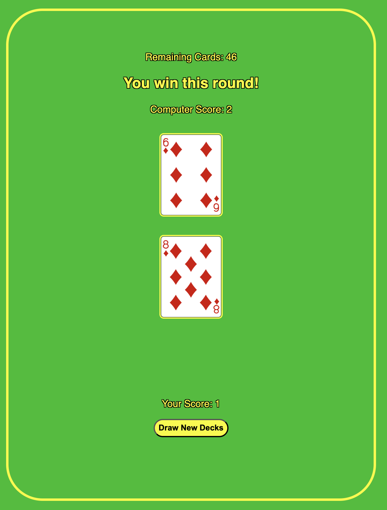

# JavaScript Mini Projects

A curated set of mini JavaScript projects showcasing core web functionality, APIs, and interactive UI behavior. Each project is built with vanilla HTML, CSS, and JavaScript.

## Projects

| Project | Description |
|---------|-------------|
| **Blackjack Game** | Browser-based blackjack — draw cards, track your sum, and decide when to hold |
| **Blog Space** | Create and post blog entries with a clean, minimal interface |
| **Bored Bot** | Generates random activity suggestions using the Bored API |
| **Passenger Counter** | Click-based counter for tracking people in real time, with save history |
| **War Game** | Two-player card game powered by the Playing Card API |
| **Business Card** | Digital personal card layout with structured content and styling |
| **Chrome Extension** | Lead tracker tool to save and manage useful links from your browser |
| **Track Mobile App** | Mobile-style UI demo for tracking features or content |

## Screenshots

<table>
  <tr>
    <td align="center"><b>Blackjack Game</b> </td>
    <td align="center"><b>Blog Space</b> </td>
  </tr>
  <tr>
    <td align="center"><b>Bored Bot</b> </td>
    <td align="center"><b>Passenger Counter</b> </td>
  </tr>
  <tr>
    <td align="center" colspan="2"><b>War Game</b> </td>
  </tr>
</table>
